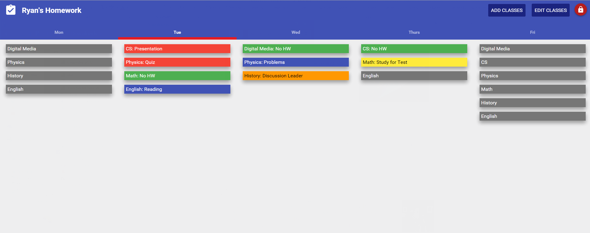
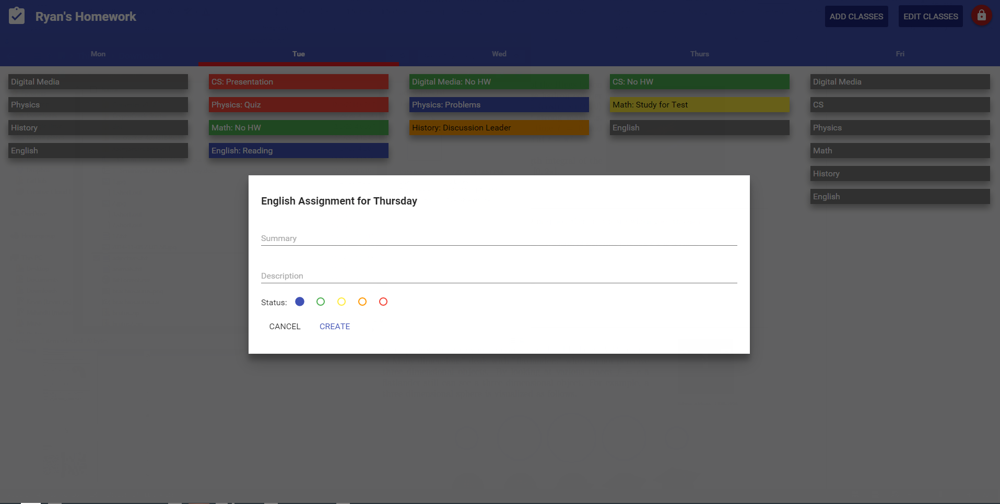
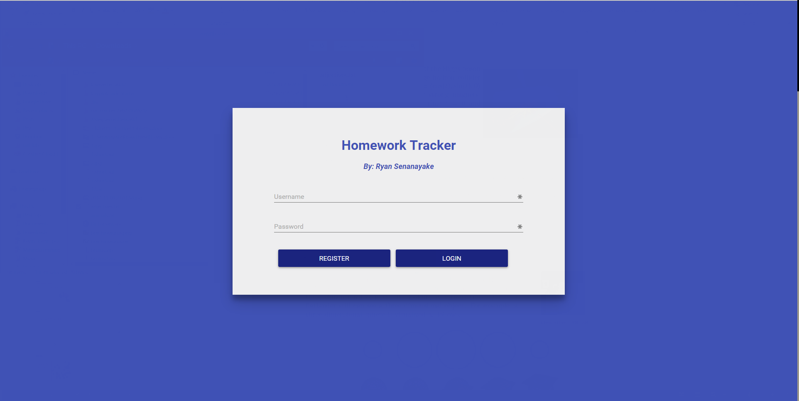
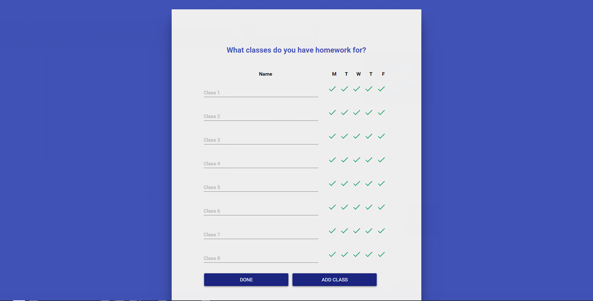

 

#Functional Overview:
Homework tracking the way it should be as a HTML/CSS/Polymer/PHP/MySql web app. The most important thing is to build a tracking system that I would use, but eventually will be expanded to fit the needs of a high school/college student who has to manage assignments from multiple classes and can’t afford to “work one day at a time” and needs to be able to have more control over their organization.

#Design Overview:

This app will use Google’s Material Design specs. To do this it will leverage Polymer components. The key for this app is to keep the interface uncluttered, yet still provide the user with ample control. Animations should be used to make checking off homework as enjoyable as possible.

After the user logins in with a username and password, they will be presented with a screen which will allow them to enter their classes and the days of the week which they have them. After they finish, they are presented with the main screen. This shows small cards for their classes for each day. By tapping on a class, the card will animate up into a larger one which allows for them to input a summary, description, due date, and progress (via color) for a assignment of that day. Once a class is given an assignment, it is moved to the top and is shown in a larger, colored card. Users can also click on the check mark to move a class to the completed list at the bottom of each day. Finally, an “other” class allows users to add assignments which are not associated with a set class.

This screen will also highlight the current day by making it slightly wider and allow for users to navigate to other weeks by clicking on the arrows to the left and right. By dragging and dropping different assignments, users can change due dates and reorder the list of assignments. If there is time, my stretch goals are to implement Google Calendar integration, automatically import a schedule from the souk, and to make the web app scale to mobile.

##Design Details:
Development will be done in HTML/CSS/Polymer/PHP/MySQL using notepad++.

For dragging and dropping, I will be referencing this: http://www.html5rocks.com/en/tutorials/dnd/basics/ 

For the animation of opening up the detailed view of an assignment, I will be referencing this: http://japhr.blogspot.com/2014/08/chip-and-card-hero-transition-in.html 

#Database Schema:
Users Table: id (int, primary, auto_increment), username (text), password (text) (md5, not actual password)
Classes Table: id (int, primary, auto_increment), user_id (int), name (text), monday (boolean), tuesday (boolean), wednesday (boolean), thursday (boolean), friday (boolean)
Assignments Table: id (int, primary, auto_increment), classes_id (int), due_date (date), summary (text), description (text), progress (int), complete (boolean), order_in_list (int)

#PHP/HTML:
login.php: A simple login page with the name of the app and a username and password box with a login and a register button below it. The PHP will need to do a select query for logging in and an insert query for registering. It is important that the php page converts the password into md5 so that it doesn’t store the actual password.

classes.php: Will have to provide for some javascript for the dynamic adding of rows with the add button. Otherwise this is just a fancy html form that will run an insert/update query at the end. As this page will be used for editing classes later, a select query should be done first to check for current classes.

index.php: See pagination section for more details. This will return the entire site and get 5 initial pages from loadpage.php.

loadpage.php: See pagination section for more details. This can be simplified to a bunch of floating lists where the data is loaded through select queries.

#A Brief Discussion of Polymer:
Polymer provides small components which you can put into regular html and provide complex functionality. Polymer also has specialized support for material design which means I can leverage it instead of building all of the components specified in the specs myself. Polymer will allow me to have shadows underneath my cards, have floating action buttons, provide for touch-ripple effects, animate the expansion of cards, and in general just give my app a consistent design. It should be emphasized that this app can be built without Polymer and it would work just fine, but Polymer allows me to enhance it visually.

#Pagination:
To prevent requiring the page to reload every time, I will use jquery/ajax loading. The way this will work is to have a loadpage.php which will return the html for a single page. Index.php will store pages for 2 weeks before and 2 weeks after the current week and will load additional pages as the buttons are pressed. If there are no more pages to load, then the button will be grayed out until more pages are available. 

Reference: http://www.sanwebe.com/2013/03/loading-more-results-from-database & http://www.sanwebe.com/2013/03/ajax-pagination-with-jquery-php 

#Testing:
Testing will be done by creating various fake users and using different inputs. I also hope to give the app to other students to see if they have any feedback. Finally, I hope to switch to this program from my current system of homework tracking which will give me some idea of where I can improve it.

#Proposed Implementation Schedule:
###Milestone 1: November 17th:
Design is completed. Polymer integrated and local MySQL database setup. Login page and screen to enter classes are functional.

###Milestone 2: November 24th:
Main screen will display data correctly, but user cannot interact with it yet.

###Milestone 3: December 1st:
Now possible to enter data through the animated edit card. Can now navigate between different weeks. Can now logout and edit classes.

###Milestone 4: December 8th:
Presentation is ready. And testing is completed. 
Optional: All animations are done. Any stretch goals are achieved. 
